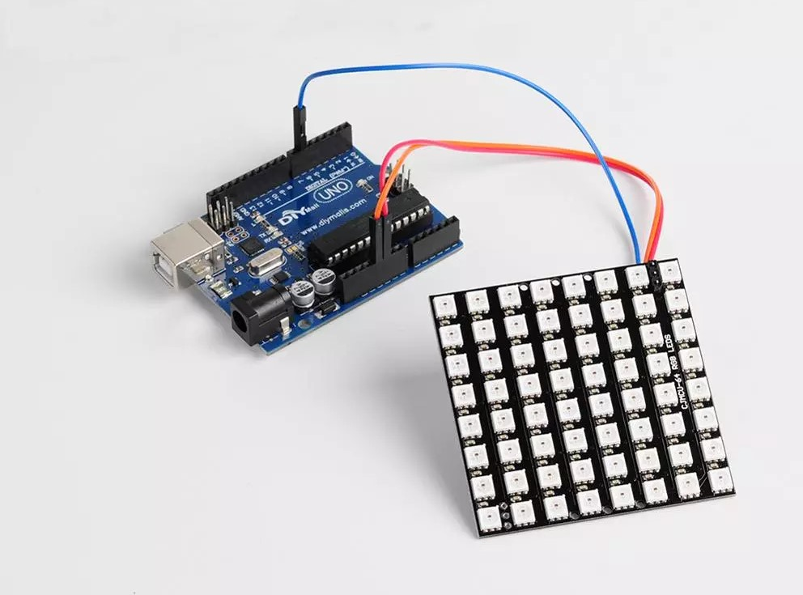
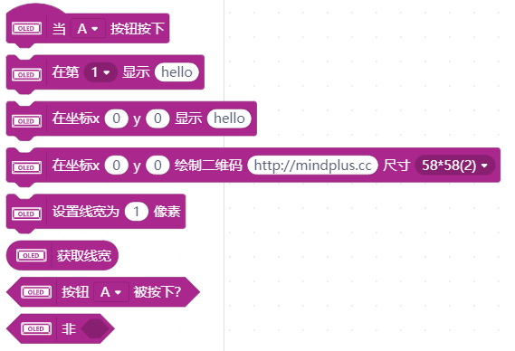
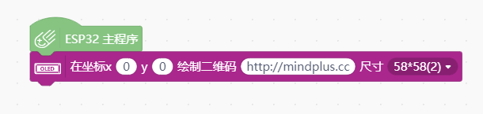

# I2C OLED-2864 显示屏




---------------------------------------------------------

## 目录

* [相关链接](#相关链接)
* [描述](#描述)
* [积木列表](#积木列表)
* [示例程序](#示例程序)
* [许可证](#许可证)
* [支持列表](#支持列表)
* [更新记录](#更新记录)

## 相关链接
* 本项目加载链接: ```https://github.com/DFRobot/ext-oled12864```

* 用户库教程链接: ```https://mindplus.dfrobot.com.cn/extensions-user```

* 购买此产品: [商城](https://www.dfrobot.com.cn/).

## 描述
支持屏幕上的不同图形，包括点，线，圆，矩形，三角形，圆角矩形和一些命令。
支持DFRobot模块的英文字符和字符库芯片。
IIC：ESP系列控制器重绘时重绘速率超过每秒30帧

## 积木列表




## 示例程序



## 许可证

MIT

## 支持列表

主板型号                | 实时模式    | ArduinoC   | MicroPython    | 备注
------------------ | :----------: | :----------: | :---------: | -----
micro:bit        |             |       √       |             | 
mpython        |             |        √      |             | 


## 更新日志
* V0.0.1  基础功能完成
* V0.0.2  根据Mind+V1.6.2 RC2.0更新此库# esp32-ws2812
